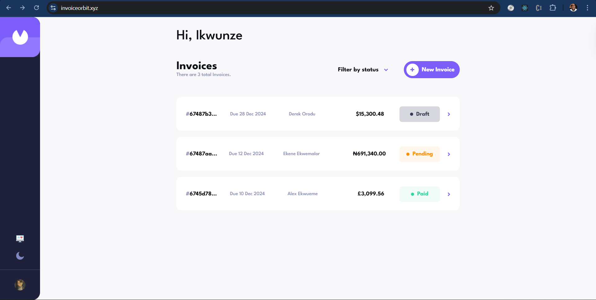

# Invoice Orbit

A full-stack invoice management application with React frontend and Node.js backend.

## Overview
This application allows users to create, manage, view analytics and track invoices digitally. It features a React frontend for user interactions and a Node.js/Express backend for data management.

---

## Screenshot


---

## Features

### Invoice Management
- Create and edit professional invoices
- Easily filter invoices by status (draft, pending, or paid)
- Multiple currency support
- Automatic invoice numbering

### Analytics Dashboard
- Revenue tracking
- Payment status monitoring
- Financial reports

---

## Project Structure
```plaintext
invoice-application/
├── frontend/
│   ├── public/             # 
│   ├── src/
│   │   ├── components/      # Reusable UI components
│   │   ├── data/            # Static or mock data
│   │   ├── hooks/           # Custom React hooks
│   │   ├── pages/           # Application pages
│   │   ├── store/           # Redux state management setup
│   │   ├── styles/          # Global and modular styles
│   │   ├── types/           # TypeScript type definitions
│   │   ├── utils/           # Utility functions
│   └── test/               # General testing utilities
│
└── backend/
    ├── controllers/        # Request handlers
    ├── db/                 # Database connection and setup
    ├── middleware/         # Custom middleware
    ├── routes/             # API routes
    ├── schema/             # Mongoose schemas
    ├── services/           # Exchange rate service setup
    ├── types/              # TypeScript type definitions
    └── utils/              # Helper functions
```
## Tech Stack

### Frontend
- React.js + TypeScript
- Redux
- Styled-Components
- Recharts
- Clerk

### Backend
- Node.js + Express
- MongoDB + Mongoose
- Clerk
- Zod

---

## Testing
- Vitest
- React Testing Library

---  

## Future Plans
- **Recurring Invoices**: Automate invoice generation for recurring bills, allowing users to schedule invoices on a periodic basis.
- **Notifications**: Add reminders for upcoming or overdue payments and notify users about invoice updates or creations.
- **Enhanced Analytics**: Provide more detailed insights and reports on invoices, payments, and client activity.
- **PDF Generation**: Allow users to genrate pdfs

---

## License
MIT License
